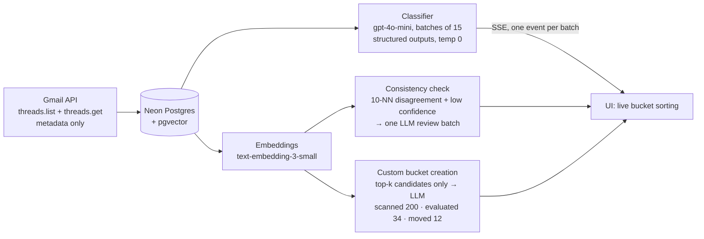

# Inbox Concierge

Sign in with Google and your last 200 inbox threads get sorted into buckets —
Important, Can Wait, Newsletter, Notifications, Auto-Archive — plus any bucket
you define in plain English ("Job Applications: recruiter outreach, interview
scheduling…"). New buckets take effect in seconds, retroactively, without
reclassifying the whole mailbox.

## Architecture

The LLM is the classifier of record; embeddings are the cheap similarity
substrate that keeps classification maintainable (a cascade: cheap retrieval
stage, expensive judgment stage).



Embeddings do four jobs:

1. **Consistency checking** — after classification, threads whose 10 nearest
   neighbors mostly disagree with their label (and whose own confidence is low)
   go back to the LLM in one review batch. The UI shows "N threads
   auto-reviewed".
2. **Incremental recategorization** — creating a bucket embeds its name +
   description, retrieves the top-k similar threads, and sends only those
   candidates to the LLM. Everything else is untouched.
   **Bucket discovery** rides the same vectors: "Suggest buckets" k-means the
   existing embeddings locally (free), and the LLM names only the clusters
   worth having as buckets — the defaults from the brief stay; discovery is
   an additive layer, and a picked suggestion just prefills normal creation.
3. **Ask your inbox** — the search bar takes a plain-English question
   ("recruiter threads about backend roles", "anything with an unpaid
   invoice") and answers it with the same two-stage cascade: the query is
   embedded and cosine-ranked to a handful of candidates (cheap retrieval),
   then one LLM pass judges which genuinely match and writes a short answer
   (expensive judgment). It reuses the classifier's id-echo guard, runs
   read-only and metadata-only like everything else, and skips the LLM
   entirely when nothing clears the similarity floor.
4. **The scaling story** — per-user brute-force cosine works to ~100k threads;
   pgvector HNSW after that; a dedicated vector DB probably never, for this
   workload.

Classification costs are asymmetric and the prompt says so: misclassifying
toward Important is a minor annoyance; burying real mail in Auto-Archive is a
missed job offer. When uncertain, the model is instructed to pick the
higher-attention bucket.

**Corrections are a feedback loop.** Every thread's bucket badge opens a
Move-to menu right in the list; re-file a thread and the placement becomes
human truth: it is never reclassified, auto-reviewed, or auto-moved again,
and the most recent corrections ride along in every future classification
prompt as authoritative examples of your preferences. Corrections are kept
separate from the eval gold set — they're made after seeing model output,
which is exactly the anchoring the gold set must avoid.

## How I know it works

`npm run eval` runs the production classification code path against a
hand-labeled gold set (threads labeled at the hidden `/label` route,
keyboard-first, in random order) and prints overall accuracy, per-bucket
precision/recall, a confusion matrix, and every miss.

`/label` is developer instrumentation, not a user flow — real users label
implicitly by re-filing threads (corrections), which is abundant but biased:
it's anchored on model output and only covers errors the user noticed. The
blind gold set exists to measure the errors nobody notices, which includes
the catastrophic ones. Catastrophic misses
(gold-Important predicted Auto-Archive) are tracked as their own number with a
target of zero. Prompt iterations are recorded in `evals/NOTES.md` with raw
results committed under `evals/results/`.

LLM self-reported confidence is treated as an ordinal routing signal
(low/medium/high), never as a probability — it's poorly calibrated, and the
consistency check uses it only as a tiebreaker for which threads deserve a
second look.

## Isn't this just Gmail's tabs?

Gmail's Primary/Promotions/Updates categories are fixed and Google-defined.
These buckets are user-defined in natural language, and they apply
retroactively over existing mail in seconds.

## Stack

- Next.js (App Router) + TypeScript on Vercel
- Auth.js (NextAuth v5) — Google OAuth **is** the Gmail access (`gmail.readonly`,
  offline access, refresh-token rotation in the JWT callback)
- Neon Postgres + pgvector, Drizzle ORM
- OpenAI: `gpt-4o-mini` for classification (structured outputs, temperature 0),
  `text-embedding-3-small` (1536-dim). One provider deliberately — the eval
  harness is the tripwire if that choice was wrong.
- SSE from a single route handler for live classification progress — no
  websockets, no event infrastructure

## Run locally

```bash
npm install
cp .env.example .env.local   # fill in the values (see comments in the file)
npm run db:migrate           # creates tables + enables pgvector
npm run dev
```

### Google OAuth note (test users)

`gmail.readonly` is a restricted scope, so the app runs in **testing mode** on
the OAuth consent screen. Google only allows manually added test users to sign
in. Send me any email address and I'll add it as a test user within the hour.

## Privacy

What gets fetched and stored: subjects, senders, dates, and Gmail's short
preview snippets — never full message bodies, which are never even fetched
(threads come down with `format=metadata`; nothing in this codebase requests
a body, and a unit test pins that). Gmail access is read-only.

Where it goes: a Neon Postgres instance, and the same metadata is sent to
the OpenAI API for classification and embeddings (OpenAI's API terms exclude
training on it). "Delete all data" in the app removes every stored row
immediately and signs you out; Neon's point-in-time restore history ages the
deleted rows out within about a day.

## Eval

```bash
npm run eval            # runs the gold set through the live prompt, writes evals/results/
npm run eval -- --dry   # print only
```

## Tests

```bash
npm test
```

Two layers of verification, on purpose: the eval measures the *judgment*
(does the LLM agree with the mailbox owner), while the unit tests pin the
*machinery* — header/entity decoding, the duplicate-id guards, retry and
backoff behavior, consistency flagging, candidate selection, token refresh,
and auth guards on every route. Each decoding and id-guard test corresponds
to a bug that actually happened during development. CI runs lint,
typecheck, tests, and build on every push.
